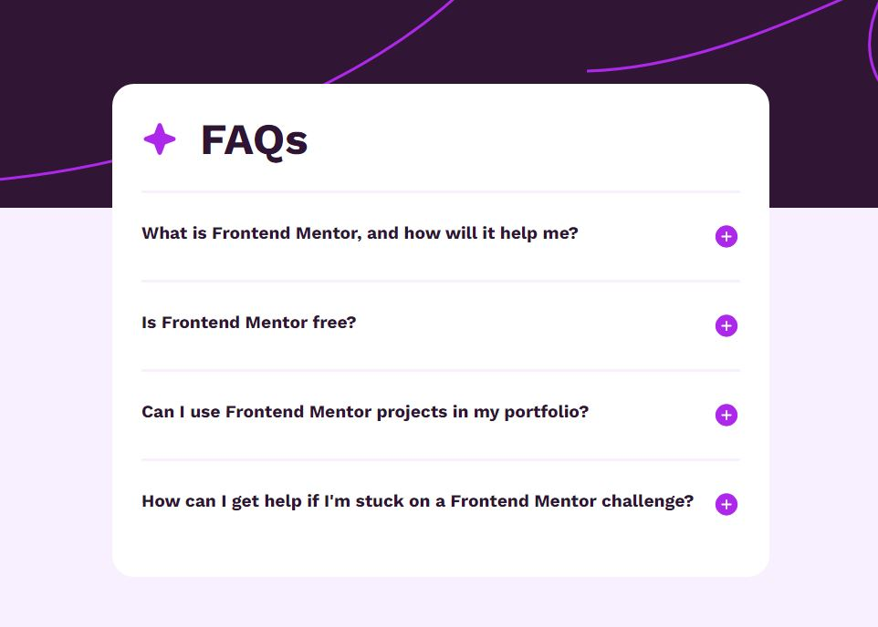

# Frontend Mentor - FAQ accordion solution

This is a solution to the [FAQ accordion challenge on Frontend Mentor](https://www.frontendmentor.io/challenges/faq-accordion-wyfFdeBwBz). Frontend Mentor challenges help you improve your coding skills by building realistic projects. 

## Table of contents

- [Overview](#overview)
  - [The challenge](#the-challenge)
  - [Screenshot](#screenshot)
  - [Links](#links)
- [My process](#my-process)
  - [Built with](#built-with)
  - [What I learned](#what-i-learned)
  - [Continued development](#continued-development)

## Overview

### The challenge

Users should be able to:

- Hide/Show the answer to a question when the question is clicked
- Navigate the questions and hide/show answers using keyboard navigation alone
- View the optimal layout for the interface depending on their device's screen size
- See hover and focus states for all interactive elements on the page

### Screenshot

### Links

- Solution URL: [Github Repo](https://github.com/UnknownBuilder/FEmentor_accordion_faq)
- Live Site URL: [Accordion Solution](https://unknownbuilder.github.io/FEmentor_accordion_faq/)

## My process

### Built with

Only used the basics. Nothing fancy here. 

-HTML
-CSS
-Javascript

### What I learned

This challenge solidified my understanding on how to use querySelector in Javascript and how to use states to effect the website. 

### Continued development

I've been MIA from programming for a month. I'm happy that I still know how to navigate the waters and come up with solutions to problems. With that said, I'm still very slow in getting things done but I'm happy about that because as of right now, the reason things are taking me so long is because I came accross something new. 

I'm going to refocus my efforts to try to finish the Front Mentor beginner challenges before the end June. It's going to be hard since I'm starting a new company this year, unrelated to programming, but I'm up for the challenge. 